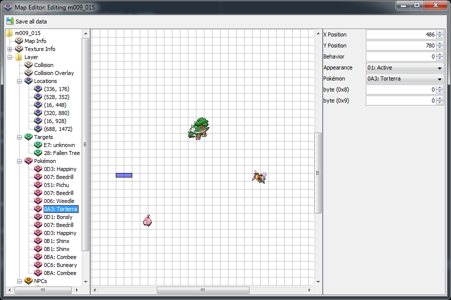

# AlmiaE

**AlmiaE** is an editing suite for **Pokémon Ranger: Shadows of Almia**. It can be used to edit maps and Pokémon data. The program is coded in Java and developed using the Netbeans IDE. Several icons were taken from **Pretty Office Icons** sets.

# Features
- edit Pokémon base stats and parameters
- edit map data (Pokémon, NPCs, targets, ...)
- LZ10/LZ11 decompression and compression

# How to use
1. Extract the game's filesystem (the param and field/map folders are needed) from the NDS ROM.
2. In AlmiaE, select the extracted filesystem via *File > Open*.
3. Click *Edit map* and select the map you want to edit.
4. Have fun.
5. After saving, import the corresponding file into the ROM again.
